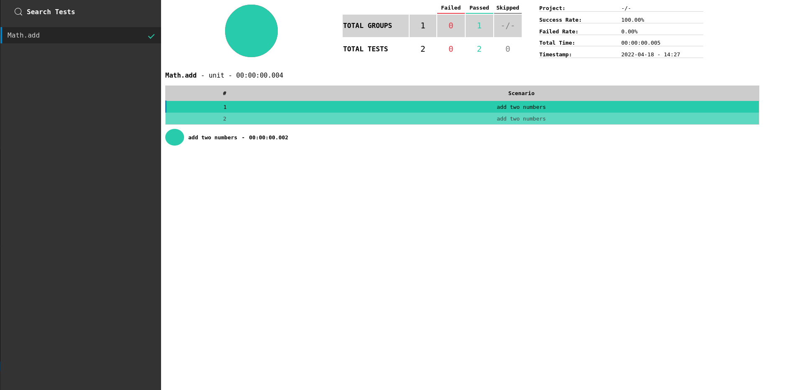

# table-driven-html-reporter
> Reporter plugin for [japa](https://japa.dev) that generates a html report with your tests 

The `table-driven-html-reporter` plugin makes it simple to generate a report for your tests suites

Just install the plugin and import to your japa config file and a `report` folder will be generated with a html file after running your tests

# Installation
Install the package from the npm registry as follows:

```sh
npm i -D table-driven-html-reporter

yarn add -D table-driven-html-reporter

pnpm add -D table-driven-html-reporter
```

# Usage

Import the package function and add it to `reporters` array
```ts
import { specReporter } from '@japa/spec-reporter'
import { tableDrivenHtmlReporter } from 'table-driven-html-reporter'

configure({
   reporters: [specReporter(), tableDrivenHtmlReporter()],
})
```
Just run your tests now. Imagine you have the default `Math.add` test group from japa. This is the resulting report:



The folder `report` will be generated with the following files:
```
template.mustache
testReport.html
```
`testReport.html` is the report itself, just open on your default browser

`template.mustache` is the report template that you change to meet your needs

# Questions

## How can i change the report name?
```ts
import { specReporter } from '@japa/spec-reporter'
import { tableDrivenHtmlReporter, TableDrivenHtmlReporterConfig} from 'table-driven-html-reporter'

const htmlReporterConf: TableDrivenHtmlReporterConfig = {
  reportName: 'customReportName' //this will be the name of the report
}

configure({
   reporters: [specReporter(), tableDrivenHtmlReporter(htmlReporterConf)],
})
```

## How can i change the directory of the report?
```ts
import { specReporter } from '@japa/spec-reporter'
import { tableDrivenHtmlReporter, TestDrivenHtmlReporterConfig} from 'table-driven-html-reporter'

const htmlReporterConf: TestDrivenHtmlReporterConfig = {
  directory: 'customDir' //this will be the name of the directory
}

configure({
   reporters: [specReporter(), tableDrivenHtmlReporter(htmlReporterConf)],
})
```


## Can i minify my report?

If you want to minify please install the following dependencies:
```
npm i -D htmlnano cssnano postcss terser
yarn add -D htmlnano cssnano postcss terser
pnpm add -D htmlnano cssnano postcss terser
```

```ts
import { specReporter } from '@japa/spec-reporter'
import { tableDrivenHtmlReporter, TestDrivenHtmlReporterConfig} from 'table-driven-html-reporter'

const htmlReporterConf: TestDrivenHtmlReporterConfig = {
  minify: true
}

configure({
   reporters: [specReporter(), tableDrivenHtmlReporter(htmlReporterConf)],
})
```

## How can i put my app name on the project?
```ts
import { specReporter } from '@japa/spec-reporter'
import { tableDrivenHtmlReporter, TestDrivenHtmlReporterConfig} from 'table-driven-html-reporter'

const htmlReporterConf: TestDrivenHtmlReporterConfig = {
  projectName: "TODO" //you project name
}

configure({
   reporters: [specReporter(), tableDrivenHtmlReporter(htmlReporterConf)],
})
```

# Worth mentioning
This reporter goes well with [table-driven-tests](https://www.npmjs.com/package/table-driven-tests) plugin

You can change the template anytime. Just edit `template.mustache` to fit your project requirements. 

When you minify your project you'll gain about 10 - 13% reduction in size.

This package is heavily inspired in gauge [report](https://github.com/getgauge/html-report)

Please open an issue if you find a problem.